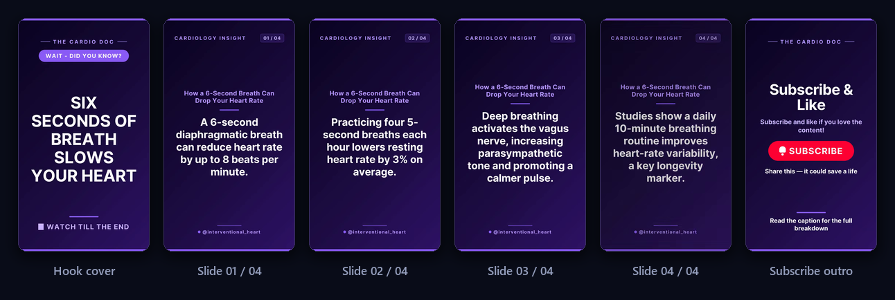
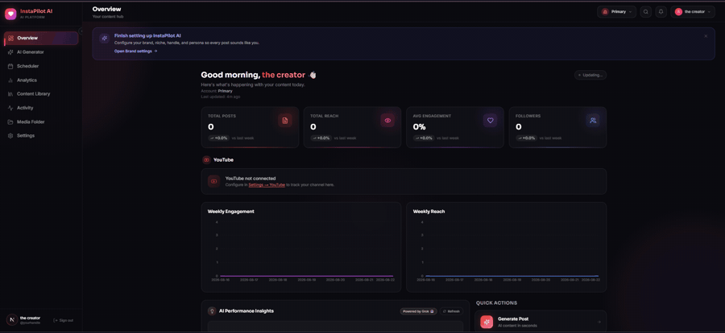
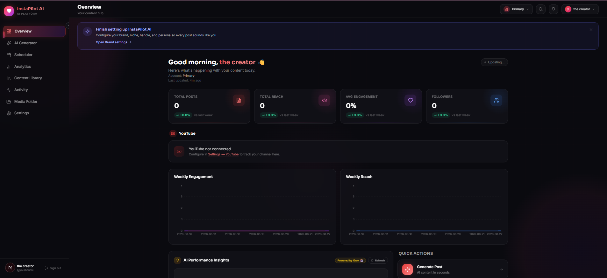
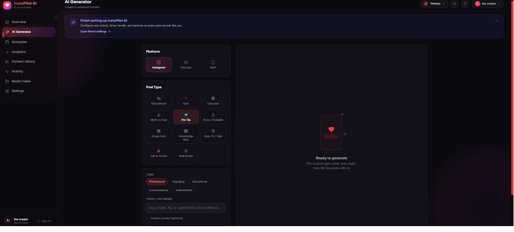
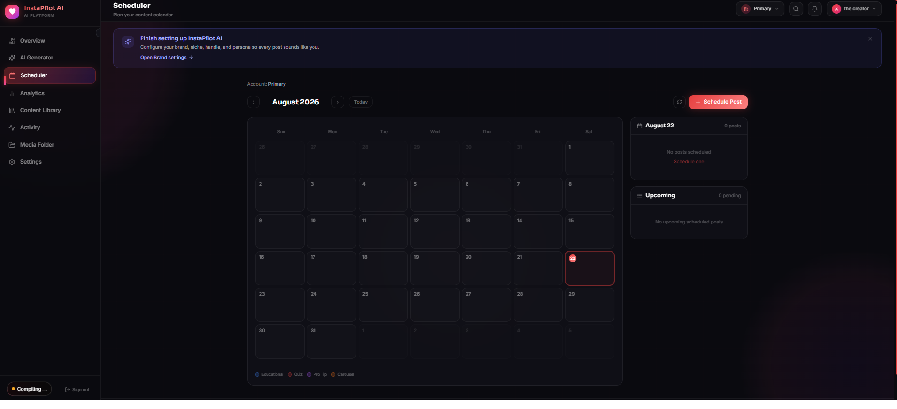
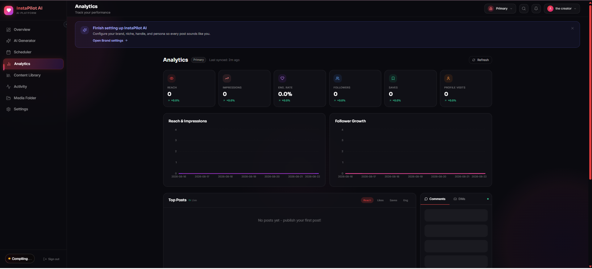
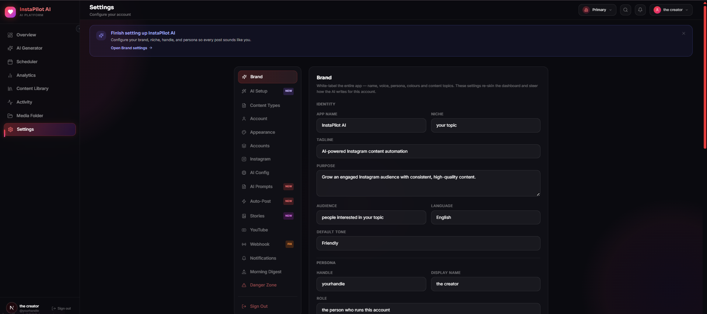
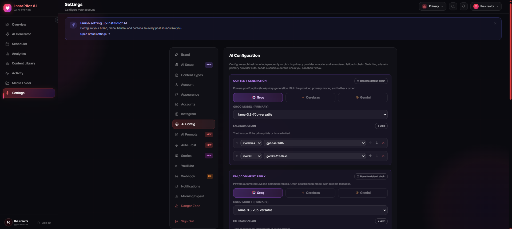
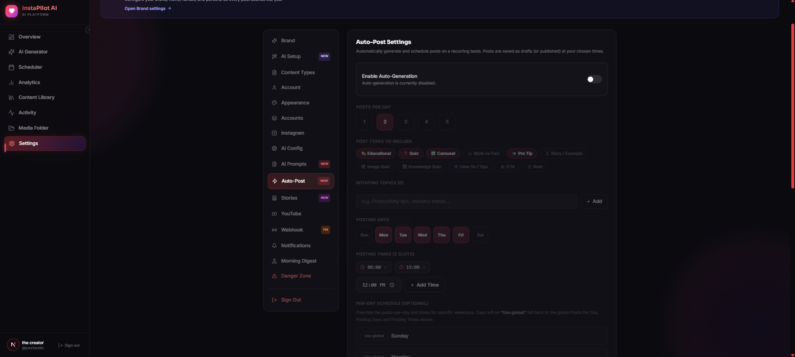
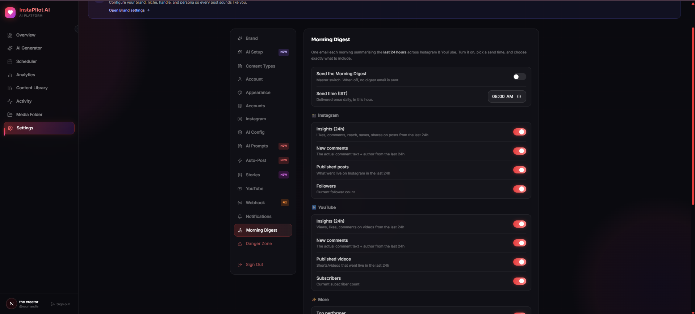

<div align="center">

# InstaPilot AI

**An AI worker that runs your Instagram and YouTube Shorts channels while you sleep.**

It picks the topic, writes the post, designs the slide cards, renders a real vertical
video with an AI voiceover, publishes it on your schedule, cross-posts it as a Reel,
and answers the comments and DMs it gets back. Any niche, your accounts, your API keys.

[](LICENSE)
[](COPYRIGHT.md)
[](https://nextjs.org)
[](#quickstart)



<sub><b>Not a mockup.</b> These are frames from <a href="https://youtube.com/shorts/QhR8nuC3Dck">a real Short</a> —
topic, script, cards, voiceover, video, title, caption and tags all generated and published unattended.</sub>

</div>

---

## What it actually does

Every day, for each brand you configure, unattended:

1. **Writes** an on-topic post with AI — rotating through your topics, and generating
   fresh ones in the same style when they run out. It de-duplicates at the *theme*
   level, not just the wording, because platforms suppress repetitive uploads.
2. **Designs** branded image cards — posts, multi-slide carousels, Stories — rendered
   server-side with Satori and Sharp.
3. **Renders a vertical Short** from those cards with ffmpeg: a ~2s curiosity hook
   cover (also uploaded as the custom thumbnail), large-text content slides, and a
   subscribe outro — with mood-matched Creative Commons music, an optional AI
   voiceover synced card-by-card, and optional word-by-word burned captions.
4. **Publishes** to YouTube and Instagram on a per-weekday schedule you set, then
   cross-posts the Short to Instagram as a Reel on its own deferred timing.
5. **Replies** to Instagram comments and DMs (including **voice notes** — Whisper in,
   TTS out) and to YouTube comments, in whatever language the person used.
6. **Reports** — daily health email, morning digest, live SSE alerts, real analytics
   pulled from the Graph and Data APIs.

## See it running

The pipeline runs a live channel end to end — topic, script, cards, video, title,
caption, tags and upload:

- **[The Cardio Doc AI](https://www.youtube.com/channel/UCbVZPr6jApgMGB_p28s9_6g/shorts)** — **105 Shorts** written, rendered and published on schedule.
- **[Example Short](https://youtube.com/shorts/QhR8nuC3Dck)** — *"How a 6-Second Breath Can Drop Your Heart Rate"*, 33s, hook cover → four content slides → subscribe outro (the frames above).
- **[The Instagram side](https://www.instagram.com/reel/DcKwp10lEGH/)** — the same renderer's output cross-posted as a Reel, carrying the AI-written rich caption: hook, six numbered stat-backed points, then the dual-account follow CTA the caption builder assembles.

To be straight about it: this is proof the *machine* runs, not proof it will make you famous.
The channel is small. What 105 unattended uploads demonstrate is that the scheduler, the
renderer, the caption chain and the upload path hold up day after day without a babysitter.

## Why it might be interesting

- **It renders the video itself.** No Canva, no template service, no headless browser.
  Cards are laid out with Satori, rasterised with Sharp, stitched to a 720×1280 H.264
  MP4 with ffmpeg, then mixed with music and narration. See
  [`lib/videoGenerator.ts`](lib/videoGenerator.ts).
- **Per-task AI fallback chains.** Content, reply, and vision each get their own
  ordered `provider · model` chain across Groq, Cerebras and Gemini, tried
  top-to-bottom. One provider's outage or quota wall falls through instead of
  failing the day.
- **Genuinely white-label.** App name, niche, persona, handles, content-type labels
  and prompts are all configured in Settings — nothing niche-specific is compiled in.
  There is an AI Setup wizard that interviews you and writes the whole config.
- **Multi-brand.** Each brand is a paired IG account + YouTube channel with its own
  skin, schedule, topics and prompts. The engine runs the full pipeline independently
  for every active brand.
- **Bring your own keys.** Nothing is bundled. Groq, Gemini, Meta, Cloudinary, Resend,
  and optionally YouTube and Jamendo — all yours.

## Quickstart

```bash
git clone https://github.com/ys941/instapilot-ai && cd instapilot-ai
npm install
cp .env.example .env.local          # fill in your keys
npm run db:generate && npm run db:push
npm run dev                         # http://localhost:3000
```

Log in with your `APP_ACCESS_KEY`, then open **Settings → AI Setup** and describe your
brand in plain English — it generates the skin, content types, topics, schedule and
persona for you. Or configure each tab by hand.

Prefer Docker:

```bash
cp .env.example .env && docker compose up -d
```

On Windows, `start-all.bat` brings up Postgres, Redis, Prisma and the dev server in one
step.

## Screenshots



<sub>The dashboard, on a fresh install before any brand is connected.</sub>

| | |
|---|---|
|  |  |
| **Overview** — health, today's queue, live activity | **AI Generator** — pick platform, type and tone |
|  |  |
| **Scheduler** — per-weekday plan, per-platform | **Analytics** — live IG + YouTube stats |

<details>
<summary>More — brand skin, AI config, auto-post, digest</summary>

 
 

</details>

## How it works

A single in-process loop (`lib/catchup.ts`) drives everything — started by
`instrumentation.ts` on boot, re-fired every 5 minutes, plus a daily timer and
Instagram webhooks. Each cycle it lists every active brand and runs the full pipeline
for each one independently. Work is idempotent and self-healing: a crashed render or a
provider outage is retried on the next pass rather than silently dropping the day.

Stack: Next.js 16 · TypeScript · PostgreSQL + Prisma · Tailwind · Satori + Sharp ·
ffmpeg-static · Groq / Cerebras / Gemini · Facebook Graph API · YouTube Data API v3 ·
Cloudinary · Railway or Docker.

## Documentation

| | |
|---|---|
| [Features](docs/FEATURES.md) | Every capability, in detail |
| [Configuration](docs/CONFIGURATION.md) | All settings and environment variables |
| [Architecture](docs/ARCHITECTURE.md) | Engine, routing, project structure |
| [Deployment](docs/DEPLOYMENT.md) | Railway, Docker, webhook setup |
| [Security](docs/SECURITY-MODEL.md) | Auth model, HMAC, SSRF guard |
| [Contributing](CONTRIBUTING.md) | Five-minute setup and open issues |

## Status and caveats

This is a working system that publishes to real accounts, not a demo. Some things you
should know before you run it:

- **You are responsible for what it publishes.** Meta and YouTube both have automation
  policies; read them. Set the schedule conservatively.
- **The Shorts pipeline is CPU-heavy.** Voiceover and burned captions are opt-in
  because they add a TTS call, a Whisper call and a re-encode per Short.
- **Vision captions, hashtags and YouTube tags** currently resolve the *primary*
  brand's vision chain regardless of which brand is publishing.
- There is no hosted demo, because a demo would have to publish to a real Instagram
  account. The live channel linked above is the demo.

## Licence

Standard [MIT](LICENSE) — use it, fork it, re-skin it, run client channels on it, keep
the money. Alongside it the project asks that credit to the original author stays
visible: the dashboard footer links to [@ys941](https://github.com/ys941) (the app name
above it stays fully white-label), and the app checks at startup that
`ATTRIBUTION_ACK="https://github.com/ys941"` is set in your environment. Nothing is
transmitted — the value is compared locally. See [COPYRIGHT.md](COPYRIGHT.md) and
[`lib/attribution.ts`](lib/attribution.ts).

All third-party API usage remains subject to those providers' terms.

## Contributing

Contributions are genuinely welcome, including your first one.
[CONTRIBUTING.md](CONTRIBUTING.md) has a five-minute local setup, a map of the
codebase, and a list of ideas looking for an owner.

## Star the repo

If InstaPilot is useful to you, star it. There is no marketing behind this
project — a star is genuinely how the next person ends up finding it.
